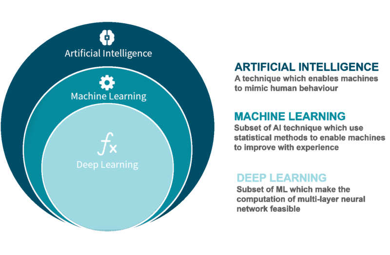

# Machine Learning for non data scientists
## 0. The basics
Some definitions before we get started ...

### Artificial intelligence (AI)
> Artificial intelligence (AI) is wide-ranging branch of computer science concerned with building smart machines capable of performing tasks that typically require human intelligence. 
[src](https://builtin.com/artificial-intelligence)

### Machine learning (ML)
> Machine learning is an application of artificial intelligence (AI) that provides systems the ability to automatically learn and improve from experience without being explicitly programmed.
[src](https://www.expert.ai/blog/machine-learning-definition/)

<!-- > Machine Learning is the study of computer algorithms that improve automatically through experience.
[src](http://www.cs.cmu.edu/afs/cs.cmu.edu/user/mitchell/ftp/mlbook.html) -->

### Deep learning
> Deep learning is an artificial intelligence (AI) function that imitates the workings of the human brain in processing data and creating patterns for use in decision making. Deep learning is a subset of machine learning.
[src](https://www.investopedia.com/terms/d/deep-learning.asp)

### Neural network

[src](https://towardsdatascience.com/designing-your-neural-networks-a5e4617027ed)

[3Blue1Brown](https://www.youtube.com/watch?v=aircAruvnKk&list=PLZHQObOWTQDNU6R1_67000Dx_ZCJB-3pi)'s youtube channel does a great job in explaining neural networks for those who wanna dive deeper.

### How are these terms related?
The terms Machine learning and Artificial intelligence are often used interchangeably, but that is not correct. ML is a subset of AI. [Symbolic AI](https://medium.com/@vbanda/good-old-fashioned-artificial-intelligence-b60800313dee) (or rule based AI or Good Old-Fashioned AI) is another subset of AI, and it does not make use of ML.

[src](https://www.gabo.de/kuenstliche-intelligenz-vs-machine-learning-definition-und-abgrenzung/)

### Different approaches for different use cases
#### Supervised learning
> Supervised learning is the machine learning task of learning a function that maps an input to an output based on example input-output pairs.

e.g. classification, regression

#### Unsupervised learning
> Unsupervised Learning is a machine learning technique in which the users do not need to supervise the model. Instead, it allows the model to work on its own to discover patterns and information that was previously undetected. It mainly deals with the unlabelled data.

e.g. clustering

#### Reinforcement learning
> Reinforcement Learning(RL) is a type of machine learning technique that enables an agent to learn in an interactive environment by trial and error using feedback from its own actions and experiences. ..

e.g. AlphaGo

